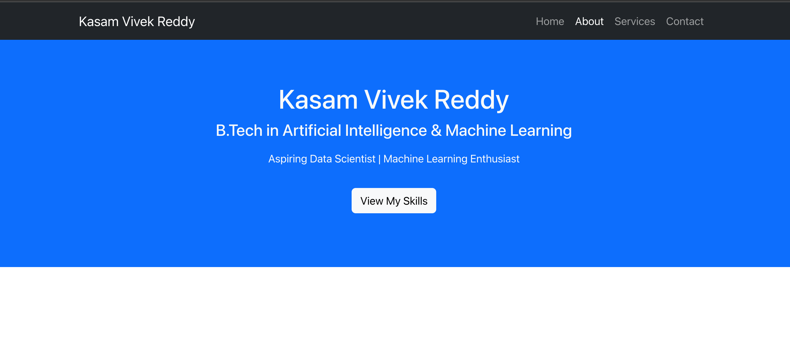
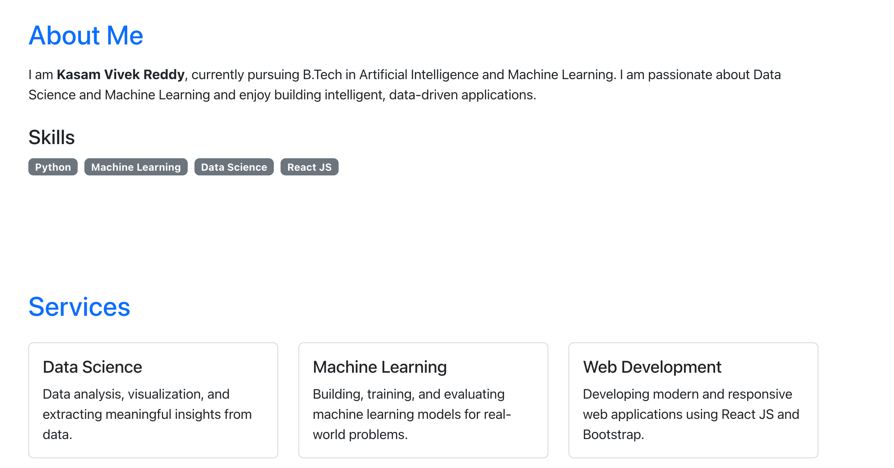
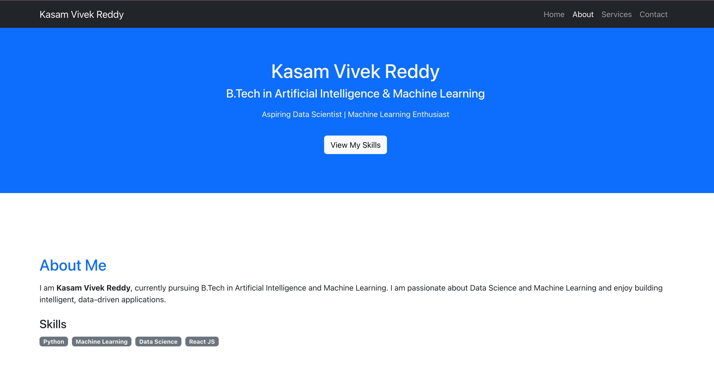

# 🌐 Modern React UI Landing Page (Experiment 2)

## 📌 Experiment Details

**Experiment 2: UI Design using Component Libraries**
Deadline: 4 February 2026

---

## 🎯 Objective

* Learn component-based UI design using React
* Understand proper folder structuring in React
* Build a meaningful, real-world web page
* Apply modern UI/UX principles

---

## 📚 Assessment Topic

Design a modern, sleek, and visually appealing web page using UI component libraries such as Bootstrap or Material UI.

---

## 🛠️ Technologies Used

* React (Create React App)
* Bootstrap (React-Bootstrap)
* JavaScript (ES6)
* HTML & CSS

---

## ✨ Features

* Clean and modern UI design
* Responsive layout (mobile + desktop)
* Component-based architecture
* Structured folder organization
* Portfolio-style meaningful webpage

---

## 📁 Folder Structure

```
src/
│
├── components/
│   ├── Navbar.jsx
│   ├── Footer.jsx
│   ├── HeroSection.jsx
│   └── CardComponent.jsx
│
├── pages/
│   ├── Home.jsx
│   ├── About.jsx
│   ├── Services.jsx
│   └── Contact.jsx
│
├── App.js
├── index.js
└── index.css
```

---

## 🧩 Project Description

This project is a modern portfolio-style web application that includes:

* Navigation bar for easy access
* Hero section introducing the user
* About section describing profile
* Services/Skills section
* Footer section

The design focuses on simplicity, responsiveness, and modern UI practices.

---

## 📷 Output Screens

### 🔹 Hero Section


### 🔹 About & Services Section


### 🔹 Homepage Preview


---

## 🌍 Deployment

👉 https://youruid-exp2-name.vercel.app

---

## 🚨 Important Notes

* Proper folder structure followed as per experiment guidelines
* Deployment naming convention followed
* Responsive and meaningful UI implemented

---

## ✅ Result

The experiment was successfully completed by designing a modern, responsive web application using React and Bootstrap with proper component structure and UI principles.

---

## 👨‍💻 Author

* Kasam Vivek Reddy
* UID: 23BAI70214
